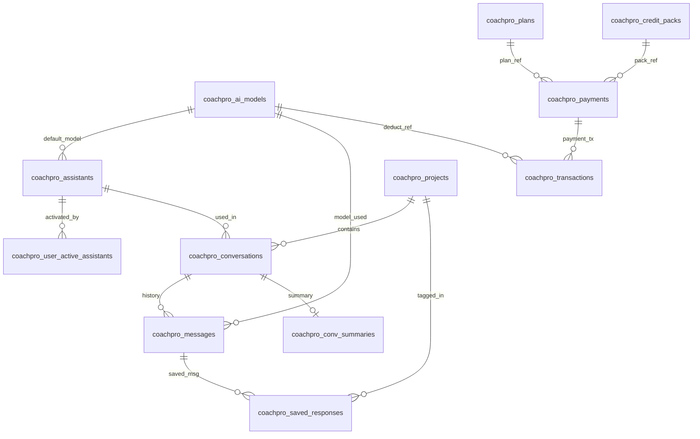
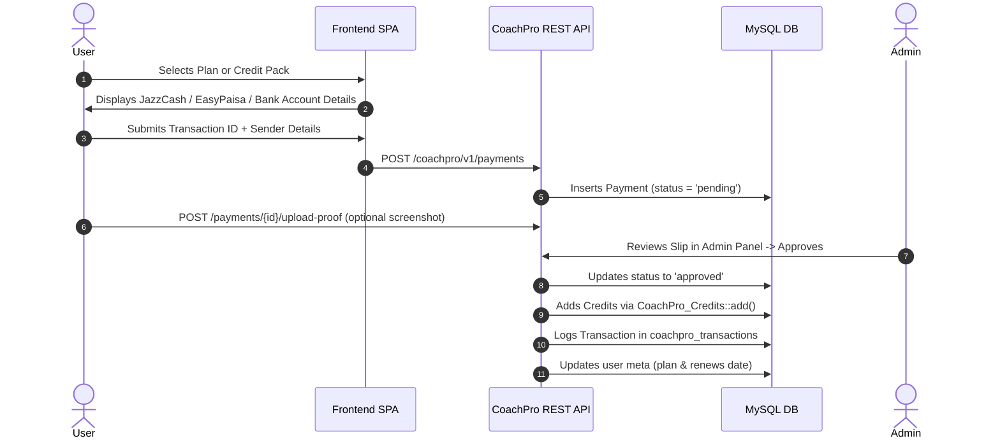

# CoachPro AI Assistant — Current State Analysis

> **Document Version:** 1.0.0  
> **Date:** September 2026  
> **Repository:** `nuzwa269/assistant` (`coachpro-ai-assistant`)  
> **Plugin Version Declared:** `1.1.1` (Constant: `COACHPRO_VERSION`), `1.1.0` (Plugin Header), `1.0.0` (Readme Stable Tag)  
> **Author:** nuzwa269  

---

## 1. Executive Summary

**CoachPro AI Assistant** is a self-hosted, 100% WordPress-native AI coaching platform designed as a WordPress plugin. It enables site owners to provide AI-assisted coaching across various disciplines (e.g., Life Coach, Business Coach, Fitness Coach) with custom prompt engineering, conversation management, projects, credit allowances, subscription tiers, and local Pakistani payment integrations (JazzCash, EasyPaisa, Bank Transfer).

The system replaces third-party backend-as-a-service dependencies (such as Supabase) with native WordPress database tables, WordPress REST API controllers, custom WP roles, and a vanilla JavaScript single-page application (SPA) delivered through shortcodes.

---

## 2. Technology Stack & Environment

| Layer | Technology / Implementation |
| :--- | :--- |
| **Platform** | WordPress 6.0+ (Tested up to 6.5) |
| **Backend Language** | PHP 7.4+ / PHP 8.x |
| **Database** | MySQL 5.7+ / MariaDB 10.3+ (WordPress `$wpdb` with `dbDelta`) |
| **API Architecture** | WordPress REST API (`/wp-json/coachpro/v1`) & WP AJAX (`admin-ajax.php`) |
| **Authentication** | WordPress Cookie Authentication, REST Nonces (`wp_rest`), Google OAuth 2.0 |
| **Frontend UI** | Vanilla JavaScript (ES6 / ES5 compatibility, no npm build required), Scoped CSS |
| **AI Integration** | Direct cURL/HTTP via `wp_remote_post` to OpenAI, Anthropic, Google Gemini, and OpenRouter/Custom |
| **Task Scheduling** | WP-Cron (`coachpro_summarize` rolling summary generation) |

---

## 3. Directory & File Structure

```
coachpro-ai-assistant/
├── coachpro-ai-assistant.php          # Main plugin bootstrap file
├── readme.txt                         # WordPress.org standard readme & metadata
├── uninstall.php                      # Cleanup script on plugin deletion
├── admin/                             # WordPress Admin panel integrations
│   ├── class-coachpro-admin.php       # Admin menus, settings, asset enqueue, post handlers
│   ├── css/
│   │   └── coachpro-admin.css         # Admin styling
│   ├── js/
│   │   └── coachpro-admin.js          # Admin dynamic SPA (Assistants, Providers, Plans)
│   └── views/                         # Admin view templates
│       ├── ai-providers.php           # AI Provider & Model Management SPA mount
│       ├── assistants.php             # Prebuilt Assistants SPA mount
│       ├── dashboard.php              # Admin overview & stats
│       ├── models.php                 # Legacy / static read-only models table
│       ├── payments.php               # Payment verification & manual approval list
│       ├── plans.php                  # Plans & Credit Packs SPA mount
│       ├── settings.php               # API keys, OAuth credentials, and page mappings
│       └── users.php                  # User credit balances & adjustments
├── includes/                          # Core backend logic & business layers
│   ├── class-coachpro-activator.php   # Activation hook, dbDelta schema, default seeding
│   ├── class-coachpro-deactivator.php # Deactivation hook, cron cleanup
│   ├── class-coachpro-loader.php      # Main hook dispatcher & template redirects
│   ├── ai/
│   │   └── class-coachpro-ai-provider.php # Multi-provider dispatch, context trim & summary
│   ├── api/                           # REST API controllers
│   │   ├── class-coachpro-admin-api.php   # Admin REST endpoints (stats, models, packs)
│   │   ├── class-coachpro-assistants-api.php # User & prebuilt assistants
│   │   ├── class-coachpro-chat-api.php       # Chat execution & AI dispatch
│   │   ├── class-coachpro-conversations-api.php # Conversation threads & message store
│   │   ├── class-coachpro-payments-api.php   # Manual payment requests & proof upload
│   │   ├── class-coachpro-profile-api.php    # User profile, transactions, saved responses
│   │   ├── class-coachpro-projects-api.php   # Workspace project containers
│   │   └── class-coachpro-rest-api.php       # Master route registration & permission checks
│   ├── auth/
│   │   └── class-coachpro-auth.php    # Custom roles, AJAX login/register, Google OAuth
│   ├── credits/
│   │   └── class-coachpro-credits.php # Balance management, transactions, plan limits
│   ├── database/
│   │   ├── class-coachpro-db.php      # DB helper abstraction (get_rows, get_row, count)
│   │   └── schema.sql                 # Reference SQL schema definition
│   └── shortcodes/
│       └── class-coachpro-shortcodes.php # Shortcode registration & frontend bootstrap
└── public/                            # Frontend assets
    ├── css/
    │   └── coachpro-frontend.css      # Scoped frontend styling and dark/light tokens
    └── js/
        └── coachpro-frontend.js       # Client SPA handling routing, chat, auth, and state
```

---

## 4. Core Subsystem Architecture

### 4.1 Database Architecture (12 Custom Tables)

All tables use the WordPress table prefix (`{$wpdb->prefix}coachpro_*`) and are provisioned via `dbDelta()` in [class-coachpro-activator.php](file:///c:/Users/IBS%20TRADER/Documents/GitHub%20Projects/assistant/includes/class-coachpro-activator.php):



1. **`coachpro_ai_models`**: Stores model identifiers, endpoints, credit costs, secret keys, and provider protocols (`openai_compatible`, `anthropic`, `gemini`, `lovable`).
2. **`coachpro_assistants`**: Coaching personas containing system prompts, categories, icons, default models, temperature, and tokens. Supports both prebuilt system assistants (`is_prebuilt = 1`) and user-created custom assistants.
3. **`coachpro_user_active_assistants`**: Junction table mapping which prebuilt assistants a user has enabled in their dashboard.
4. **`coachpro_projects`**: Workspace folders to group client conversations and saved insights.
5. **`coachpro_conversations`**: Chat sessions tied to a specific project and assistant.
6. **`coachpro_messages`**: Individual messages (roles: `user`, `assistant`, `system`), credits spent, and associated model ID.
7. **`coachpro_conv_summaries`**: Rolling conversation memory and durable bullet facts for long-running contexts.
8. **`coachpro_saved_responses`**: Bookmarked AI responses saved by users for quick reference.
9. **`coachpro_plans`**: Subscription tiers (`free`, `basic`, `pro`) with monthly credit allowances and quota limits.
10. **`coachpro_credit_packs`**: One-off top-up packages with credit amounts and PKR pricing.
11. **`coachpro_payments`**: Manual transaction slips, proof image uploads, and admin review statuses (`pending`, `approved`, `rejected`).
12. **`coachpro_transactions`**: Complete audit log of all credit balance changes (credits in, deductions, adjustments).

---

### 4.2 Authentication & User Lifecycle

- **Roles Registered:**
  - `coachpro_user`: Standard subscriber with basic read capabilities.
  - `coachpro_admin`: Plugin administrator role with `coachpro_admin` capability.
- **Registration Flow:**
  - Standard user registration assigns role `coachpro_user`.
  - Sets default user meta: `coachpro_plan = 'free'`, `coachpro_credits = 0`, `coachpro_plan_renews = ''`.
  - Grants a signup bonus (default: 20 credits, configurable via option `coachpro_signup_bonus`).
- **Authentication Routes:**
  - AJAX actions via `admin-ajax.php`: `coachpro_login`, `coachpro_register`, `coachpro_forgot_password`, `coachpro_logout`, `coachpro_check_auth`.
  - REST Google OAuth 2.0 endpoints: `GET /wp-json/coachpro/v1/auth/google` and `GET /wp-json/coachpro/v1/auth/google/callback`.
  - User session uses standard WordPress auth cookies (`wp_set_auth_cookie`).

---

### 4.3 AI Engine & Provider Architecture

The AI layer in [class-coachpro-ai-provider.php](file:///c:/Users/IBS%20TRADER/Documents/GitHub%20Projects/assistant/includes/ai/class-coachpro-ai-provider.php) acts as a unified gateway for multiple large language model vendors:

1. **OpenAI-Compatible (`call_openai_compatible`)**:
   - Supports OpenAI (e.g. `gpt-4o`, `gpt-4o-mini`), OpenRouter, and any custom endpoint following the `/chat/completions` specification.
2. **Anthropic (`call_anthropic`)**:
   - Dispatches requests to `/v1/messages`.
   - Separates the `system` prompt from conversation history to conform with Anthropic API requirements.
3. **Google Gemini (`call_gemini`)**:
   - Translates messages to Gemini's `contents` format (`role: "user" | "model"`) and `systemInstruction`.
   - Dispatches to Google's REST endpoint via `rawurlencode` query parameters.
4. **Context & Summary Optimization:**
   - Every 20 messages, a WP-Cron task (`coachpro_summarize`) is scheduled to generate a rolling summary and durable facts using the cheapest active model.
   - If an API call encounters a context-overflow error, `force_summarize_and_trim()` falls back to keeping the summary plus the last 10 messages.

---

### 4.4 Credit Economy & Payment Verification



- **Credit Deduction:**
  - Occurs on a per-message basis based on the model's assigned `credits_cost`.
  - Deductions are recorded in `coachpro_transactions` with negative amount and kind `message_deduct`.
- **Payment Verification:**
  - Manual verification workflow tailored to Pakistani payment rails (JazzCash, EasyPaisa, manual bank wire).
  - Admins approve or reject payments via WordPress Admin POST handlers or REST endpoints.

---

### 4.5 Shortcodes & Frontend Architecture

The plugin renders a dynamic client-side SPA inside WordPress posts or pages via shortcodes:

| Shortcode | Target View | Primary Function |
| :--- | :--- | :--- |
| `[coachpro]` / `[coachpro_dashboard]` | `dashboard` | User dashboard, quick chat, recent projects, credit status |
| `[coachpro_chat]` | `chat` | 3-column chat interface, conversation history, model picker |
| `[coachpro_projects]` | `projects` | Project directory, create/delete projects |
| `[coachpro_assistants]` | `assistants` | Directory of prebuilt & custom assistants with activation toggles |
| `[coachpro_saved]` | `saved` | Bookmarked AI responses |
| `[coachpro_buy_credits]` | `buy_credits` | Subscription plans, credit packs, and payment slip forms |
| `[coachpro_settings]` | `settings` | Profile name, email, and password management |
| `[coachpro_login]` | `login` | Login form with Google OAuth button |
| `[coachpro_register]` | `register` | User sign-up form |
| `[coachpro_transactions]` | `transactions` | Ledger of credit grants and deductions |
| `[coachpro_help]` | `help` | User guidelines and FAQ accordion |

---

### 4.6 WordPress Admin Panel

Located under the WordPress Admin Menu item **CoachPro AI**:
- **Dashboard (`page_dashboard`)**: Metric cards for total users, today's messages, pending payments, total credits issued.
- **Users (`page_users`)**: Lists users with their current plans and credit balances, with a modal to adjust credits manually.
- **Payments (`page_payments`)**: Review table for pending, approved, and rejected manual transactions with proof viewer and approve/reject forms.
- **AI Providers (`page_ai-providers`)**: Single-page app to configure API keys, test provider connectivity, and manage AI models.
- **Prebuilt Assistants (`page_assistants`)**: Dynamic UI to create and edit system-wide assistants, set system prompts, temperature, and tokens.
- **Plans & Packs (`page_plans`)**: Dynamic CRUD interface for subscription tiers and credit packs.
- **Settings (`page_settings`)**: Standard WordPress settings form managing Google OAuth Client ID/Secret, payment receiver accounts, signup bonus, and page associations.
- **AI Models (`page_models`)**: Static table showing model records in the database.

---

## 5. Security & Permission Architecture

1. **WordPress Capabilities:**
   - Admin settings, views, and routes rely on `manage_options`.
   - Frontend and standard REST routes rely on `is_user_logged_in()`.
2. **CSRF & Nonce Protection:**
   - REST API requests authenticate cookie sessions using the `X-WP-Nonce` header (`wp_rest`).
   - Admin POST actions use `check_admin_referer()`.
   - AJAX endpoints use `check_ajax_referer('wp_rest', 'nonce')`.
3. **Data Sanitization & Escaping:**
   - Input sanitization utilizes `sanitize_text_field()`, `sanitize_email()`, `absint()`, `esc_url_raw()`, and `wp_kses_post()`.
   - Database operations use prepared statements (`$wpdb->prepare()`) and parameterized queries.
