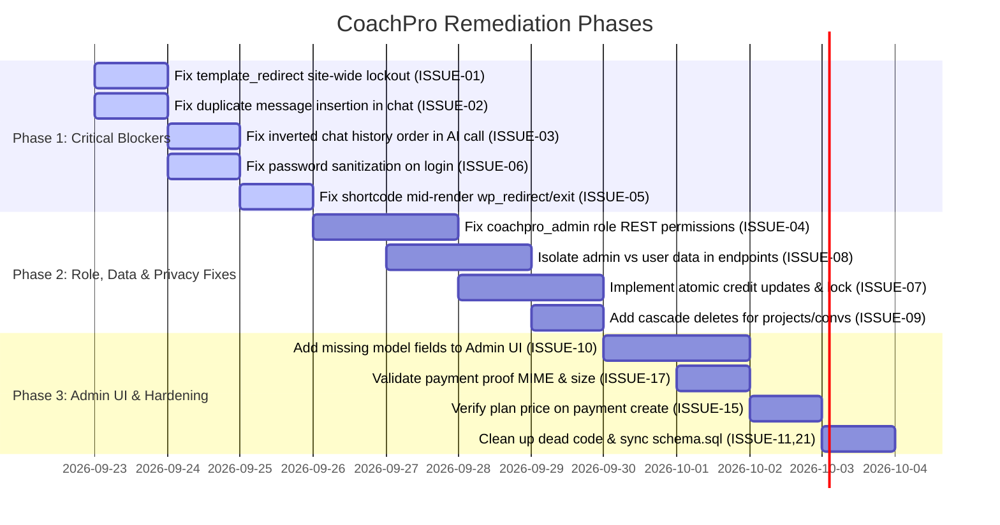

# CoachPro AI Assistant — Issues Register

> **Document Version:** 1.0.0  
> **Date:** September 2026  
> **Repository:** `nuzwa269/assistant` (`coachpro-ai-assistant`)  
> **Status:** Open Audit  

---

## 1. Issue Classification Matrix

| ID | Title | Category | Severity | File Reference | Status |
| :--- | :--- | :--- | :--- | :--- | :--- |
| **ISSUE-01** | Site-Wide Forced Redirect of Unauthenticated Visitors | Architecture / Usability | **CRITICAL** | [`class-coachpro-loader.php:52-136`](file:///c:/Users/IBS%20TRADER/Documents/GitHub%20Projects/assistant/includes/class-coachpro-loader.php#L52-L136) | ✅ Resolved |
| **ISSUE-02** | User Message Duplicated in DB on Every Chat Turn | Logic / Data Integrity | **CRITICAL** | [`coachpro-frontend.js:1249-1264`](file:///c:/Users/IBS%20TRADER/Documents/GitHub%20Projects/assistant/public/js/coachpro-frontend.js#L1249-L1264)<br>[`class-coachpro-chat-api.php:67-79`](file:///c:/Users/IBS%20TRADER/Documents/GitHub%20Projects/assistant/includes/api/class-coachpro-chat-api.php#L67-L79) | ✅ Resolved |
| **ISSUE-03** | Inverted Chat History Truncation (Oldest vs Recent Messages) | Logic / AI Quality | **HIGH** | [`class-coachpro-chat-api.php:90-93`](file:///c:/Users/IBS%20TRADER/Documents/GitHub%20Projects/assistant/includes/api/class-coachpro-chat-api.php#L90-L93) | ✅ Resolved |
| **ISSUE-04** | `coachpro_admin` Role Blocked From All Admin REST Endpoints | Access Control / Auth | **HIGH** | [`class-coachpro-rest-api.php:363-365`](file:///c:/Users/IBS%20TRADER/Documents/GitHub%20Projects/assistant/includes/api/class-coachpro-rest-api.php#L363-L365)<br>[`class-coachpro-auth.php:296`](file:///c:/Users/IBS%20TRADER/Documents/GitHub%20Projects/assistant/includes/auth/class-coachpro-auth.php#L296) | ✅ Resolved |
| **ISSUE-05** | Mid-Render `wp_redirect()` Calling `exit;` Inside Shortcode | Reliability / Bug | **HIGH** | [`class-coachpro-shortcodes.php:65-66, 73-75`](file:///c:/Users/IBS%20TRADER/Documents/GitHub%20Projects/assistant/includes/shortcodes/class-coachpro-shortcodes.php#L65-L66) | ✅ Resolved |
| **ISSUE-06** | `sanitize_text_field()` Applied to Passwords During Login | Auth / Bug | **HIGH** | [`class-coachpro-auth.php:59`](file:///c:/Users/IBS%20TRADER/Documents/GitHub%20Projects/assistant/includes/auth/class-coachpro-auth.php#L59) | ✅ Resolved |
| **ISSUE-07** | Non-Atomic Credit Deductions & Race Condition on Balances | Concurrency / Data Integrity | **HIGH** | [`class-coachpro-credits.php:34-41, 58-71`](file:///c:/Users/IBS%20TRADER/Documents/GitHub%20Projects/assistant/includes/credits/class-coachpro-credits.php#L34-L41) | ✅ Resolved |
| **ISSUE-08** | Global Data Exposure to Admins in Personal Endpoints | Data Privacy / Logic | **HIGH** | [`class-coachpro-projects-api.php:25-28`](file:///c:/Users/IBS%20TRADER/Documents/GitHub%20Projects/assistant/includes/api/class-coachpro-projects-api.php#L25-L28)<br>[`class-coachpro-conversations-api.php:27-29`](file:///c:/Users/IBS%20TRADER/Documents/GitHub%20Projects/assistant/includes/api/class-coachpro-conversations-api.php#L27-L29)<br>[`class-coachpro-profile-api.php:62-64, 80-88`](file:///c:/Users/IBS%20TRADER/Documents/GitHub%20Projects/assistant/includes/api/class-coachpro-profile-api.php#L62-L64) | ✅ Resolved |
| **ISSUE-09** | Missing Cascade Deletion Leading to Orphaned Records | Database Integrity | **MEDIUM** | [`class-coachpro-projects-api.php:104`](file:///c:/Users/IBS%20TRADER/Documents/GitHub%20Projects/assistant/includes/api/class-coachpro-projects-api.php#L104)<br>[`class-coachpro-conversations-api.php:123-125`](file:///c:/Users/IBS%20TRADER/Documents/GitHub%20Projects/assistant/includes/api/class-coachpro-conversations-api.php#L123-L125) | ✅ Resolved |
| **ISSUE-10** | Admin Model UI Omits `credits_cost`, `min_plan`, & `category` | Admin UI / Logic | **MEDIUM** | [`coachpro-admin.js:368-475`](file:///c:/Users/IBS%20TRADER/Documents/GitHub%20Projects/assistant/admin/js/coachpro-admin.js#L368-L475)<br>[`class-coachpro-admin-api.php:444-446`](file:///c:/Users/IBS%20TRADER/Documents/GitHub%20Projects/assistant/includes/api/class-coachpro-admin-api.php#L444-L446) | ✅ Resolved |
| **ISSUE-11** | Schema Discrepancy: `schema.sql` Out of Sync with Activator | DB Maintenance | **MEDIUM** | [`schema.sql:10, 59`](file:///c:/Users/IBS%20TRADER/Documents/GitHub%20Projects/assistant/includes/database/schema.sql#L10)<br>[`class-coachpro-activator.php:51, 59, 76-79`](file:///c:/Users/IBS%20TRADER/Documents/GitHub%20Projects/assistant/includes/class-coachpro-activator.php#L51) | ✅ Resolved |
| **ISSUE-12** | Version Number Inconsistencies Across Codebase | Documentation / Release | **LOW** | [`coachpro-ai-assistant.php:6, 14`](file:///c:/Users/IBS%20TRADER/Documents/GitHub%20Projects/assistant/coachpro-ai-assistant.php#L6)<br>[`readme.txt:6`](file:///c:/Users/IBS%20TRADER/Documents/GitHub%20Projects/assistant/readme.txt#L6) | ✅ Resolved |
| **ISSUE-13** | Inability to Clear / Delete Stored API Keys in Admin UI | Admin Settings | **LOW** | [`class-coachpro-admin-api.php:493`](file:///c:/Users/IBS%20TRADER/Documents/GitHub%20Projects/assistant/includes/api/class-coachpro-admin-api.php#L493) | ✅ Resolved |
| **ISSUE-14** | Plaintext API Keys in `wp_options` Table | Security / Storage | **MEDIUM** | [`class-coachpro-admin-api.php:494`](file:///c:/Users/IBS%20TRADER/Documents/GitHub%20Projects/assistant/includes/api/class-coachpro-admin-api.php#L494) | ⚠️ Deferred (env-config) |
| **ISSUE-15** | Arbitrary Unvalidated `amount_pkr` in Payment Requests | Business Logic | **MEDIUM** | [`class-coachpro-payments-api.php:43`](file:///c:/Users/IBS%20TRADER/Documents/GitHub%20Projects/assistant/includes/api/class-coachpro-payments-api.php#L43) | ✅ Resolved |
| **ISSUE-16** | Subscription Expiration Date Reset Instead of Extension | Business Logic | **MEDIUM** | [`class-coachpro-admin-api.php:325`](file:///c:/Users/IBS%20TRADER/Documents/GitHub%20Projects/assistant/includes/api/class-coachpro-admin-api.php#L325)<br>[`class-coachpro-admin.php:181`](file:///c:/Users/IBS%20TRADER/Documents/GitHub%20Projects/assistant/admin/class-coachpro-admin.php#L181) | ✅ Resolved |
| **ISSUE-17** | Unrestricted MIME Types / File Size in Payment Proof Upload | Security / Uploads | **MEDIUM** | [`class-coachpro-payments-api.php:89-90`](file:///c:/Users/IBS%20TRADER/Documents/GitHub%20Projects/assistant/includes/api/class-coachpro-payments-api.php#L89-L90) | ✅ Resolved |
| **ISSUE-18** | SQL Injection Risk via Unsanitized `$order` in DB Helper | Security / Database | **MEDIUM** | [`class-coachpro-db.php:46-48`](file:///c:/Users/IBS%20TRADER/Documents/GitHub%20Projects/assistant/includes/database/class-coachpro-db.php#L46-L48) | ✅ Resolved |
| **ISSUE-19** | Profile Password and Email Updates Lack Verification | Security / Auth | **MEDIUM** | [`class-coachpro-profile-api.php:38-47`](file:///c:/Users/IBS%20TRADER/Documents/GitHub%20Projects/assistant/includes/api/class-coachpro-profile-api.php#L38-L47) | ✅ Resolved |
| **ISSUE-20** | Inconsistent REST Nonce Verification in Admin API | Security / Consistency | **LOW** | [`class-coachpro-admin-api.php:261, 286, 334, 700`](file:///c:/Users/IBS%20TRADER/Documents/GitHub%20Projects/assistant/includes/api/class-coachpro-admin-api.php#L261) | ⚠️ Deferred (architectural) |
| **ISSUE-21** | Dead / Obsolete Code: Duplicate Chat Renderer & Static View | Code Cleanliness | **LOW** | [`coachpro-frontend.js:1324-1406`](file:///c:/Users/IBS%20TRADER/Documents/GitHub%20Projects/assistant/public/js/coachpro-frontend.js#L1324-L1406)<br>[`admin/views/models.php`](file:///c:/Users/IBS%20TRADER/Documents/GitHub%20Projects/assistant/admin/views/models.php) | ⚠️ Deferred (cleanup) |

---

## 2. Detailed Technical Issue Reports

### ISSUE-01: Site-Wide Forced Redirect of Unauthenticated Visitors
- **Severity:** `CRITICAL`
- **Location:** [`includes/class-coachpro-loader.php:52-136`](file:///c:/Users/IBS%20TRADER/Documents/GitHub%20Projects/assistant/includes/class-coachpro-loader.php#L52-L136)
- **Description:**  
  `CoachPro_Loader::maybe_redirect_to_login()` is hooked to the core WordPress `template_redirect` action. It checks if a user is logged in, and if not, runs:
  ```php
  $should_redirect = apply_filters( 'coachpro_should_redirect_to_login', true, $current_id, $login_page_id, $register_page_id );
  if ( ! $should_redirect ) {
      return;
  }
  ```
- **Root Cause:**  
  The filter defaults to `true` without first verifying whether the current requested post, page, or archive contains a CoachPro shortcode or belongs to the CoachPro app.
- **Impact:**  
  Any public visitor navigating to ANY page of the site (e.g., the website homepage, blog articles, about us, contact forms, or WooCommerce shop pages) is immediately hit with an HTTP 302 redirect to the CoachPro login page. Activating the plugin locks down the entire website.
- **Remediation:**  
  Before defaulting to redirect, inspect whether the current queried object has CoachPro shortcodes (`has_shortcode`) or matches assigned CoachPro page IDs (`coachpro_page_*`). If the page is a standard WordPress public post or page, return early.

---

### ISSUE-02: User Message Duplicated in DB on Every Chat Turn
- **Severity:** `CRITICAL`
- **Location:**  
  - Frontend: [`public/js/coachpro-frontend.js:1249-1264`](file:///c:/Users/IBS%20TRADER/Documents/GitHub%20Projects/assistant/public/js/coachpro-frontend.js#L1249-L1264)
  - Backend: [`includes/api/class-coachpro-chat-api.php:67-79`](file:///c:/Users/IBS%20TRADER/Documents/GitHub%20Projects/assistant/includes/api/class-coachpro-chat-api.php#L67-L79)
- **Description:**  
  In `coachpro-frontend.js`, `handleSend()` executes:
  ```javascript
  api(cfg, 'conversations/' + convRow.id + '/messages', 'POST', {
    role: 'user',
    content: text
  }).then(function () {
    return api(cfg, 'chat', 'POST', {
      conversation_id: convRow.id,
      model_id: state.modelId,
      message: text
    });
  });
  ```
  Then in `CoachPro_Chat_API::handle_chat()`:
  ```php
  $user_msg_id = wp_generate_uuid4();
  $wpdb->insert(
      CoachPro_DB::table( 'messages' ),
      array(
          'id' => $user_msg_id,
          'conversation_id' => $conv_id,
          'role' => 'user',
          'content' => $user_msg, ...
      )
  );
  ```
- **Root Cause:**  
  Both the client SPA and the `/chat` endpoint persist the user's prompt independently.
- **Impact:**  
  Two identical user messages are saved in MySQL for every single prompt. When messages are reloaded, conversation history displays duplicated user text, and subsequent LLM calls receive duplicate prompts in their context payload.
- **Remediation:**  
  Remove the redundant `POST conversations/{id}/messages` call from `handleSend()`, letting `/chat` handle the atomic insertion of the user prompt and assistant response together.

---

### ISSUE-03: Inverted Chat History Truncation (Oldest vs Recent Messages)
- **Severity:** `HIGH`
- **Location:** [`includes/api/class-coachpro-chat-api.php:90-93`](file:///c:/Users/IBS%20TRADER/Documents/GitHub%20Projects/assistant/includes/api/class-coachpro-chat-api.php#L90-L93)
- **Description:**  
  When fetching conversation history to supply the AI context window, the query executes:
  ```sql
  SELECT role, content FROM `{$t_msg}` WHERE conversation_id = %s ORDER BY created_at ASC LIMIT 20
  ```
- **Root Cause:**  
  `ORDER BY created_at ASC LIMIT 20` retrieves the **first 20 messages ever sent** in the conversation instead of the **most recent 20 messages**.
- **Impact:**  
  In any thread exceeding 20 messages, the AI is starved of recent context. The AI only remembers messages from days or weeks ago, ignoring everything recently discussed.
- **Remediation:**  
  Select with `ORDER BY created_at DESC LIMIT 20`, and reverse the returned array in PHP (`array_reverse`) before dispatching to the provider.

---

### ISSUE-04: `coachpro_admin` Role Blocked From All Admin REST Endpoints
- **Severity:** `HIGH`
- **Location:**  
  - [`includes/api/class-coachpro-rest-api.php:363-365`](file:///c:/Users/IBS%20TRADER/Documents/GitHub%20Projects/assistant/includes/api/class-coachpro-rest-api.php#L363-L365)
  - [`includes/auth/class-coachpro-auth.php:296`](file:///c:/Users/IBS%20TRADER/Documents/GitHub%20Projects/assistant/includes/auth/class-coachpro-auth.php#L296)
  - [`admin/class-coachpro-admin.php:149, 195, 226`](file:///c:/Users/IBS%20TRADER/Documents/GitHub%20Projects/assistant/admin/class-coachpro-admin.php#L149)
- **Description:**  
  The plugin registers a role `coachpro_admin` with capability `coachpro_admin`. However, the REST permission callback `is_coachpro_admin()` checks:
  ```php
  public static function is_coachpro_admin() : bool {
      return current_user_can( 'manage_options' );
  }
  ```
- **Root Cause:**  
  The permission check hardcodes `manage_options` (an Administrator capability) rather than checking `current_user_can( 'coachpro_admin' ) || current_user_can( 'manage_options' )`.
- **Impact:**  
  A user explicitly assigned the `CoachPro Admin` role receives `403 Forbidden` on all admin REST routes, preventing them from administering models, assistants, payments, or viewing stats.
- **Remediation:**  
  Update `is_coachpro_admin()` to:
  ```php
  return current_user_can( 'coachpro_admin' ) || current_user_can( 'manage_options' );
  ```

---

### ISSUE-05: Mid-Render `wp_redirect()` Calling `exit;` Inside Shortcode
- **Severity:** `HIGH`
- **Location:** [`includes/shortcodes/class-coachpro-shortcodes.php:65-66, 73-75`](file:///c:/Users/IBS%20TRADER/Documents/GitHub%20Projects/assistant/includes/shortcodes/class-coachpro-shortcodes.php#L65-L66)
- **Description:**  
  Inside `CoachPro_Shortcodes::render()`:
  ```php
  $login_url = add_query_arg( 'redirect_to', $redirect_to, $login_url );
  wp_redirect( $login_url );
  exit;
  ```
- **Root Cause:**  
  Shortcodes are parsed during page body rendering (via `the_content`), at which point HTTP headers have already been sent to the browser.
- **Impact:**  
  Triggering `wp_redirect()` outputs a PHP Warning (`Cannot modify header information - headers already sent`), and `exit;` immediately halts execution, causing a white screen / blank truncated page for unauthenticated users.
- **Remediation:**  
  Do not redirect via PHP during shortcode execution. Instead, return a client-side login container or execute a JavaScript redirection (`window.location.href = ...`).

---

### ISSUE-06: `sanitize_text_field()` Applied to Passwords During Login
- **Severity:** `HIGH`
- **Location:** [`includes/auth/class-coachpro-auth.php:59`](file:///c:/Users/IBS%20TRADER/Documents/GitHub%20Projects/assistant/includes/auth/class-coachpro-auth.php#L59)
- **Description:**  
  In `CoachPro_Auth::ajax_login()`:
  ```php
  $password = sanitize_text_field( wp_unslash( $_POST['password'] ?? '' ) );
  ```
  Whereas in `CoachPro_Auth::ajax_register()`:
  ```php
  $password = wp_unslash( $_POST['password'] ?? '' );
  ```
- **Root Cause:**  
  `sanitize_text_field()` strips HTML tags, transforms entities, and removes byte sequences. Passwords must never be sanitized with text cleaners.
- **Impact:**  
  If a user signs up with a password containing characters such as `<`, `>`, or consecutive whitespace, registration stores the raw hash. On login, `sanitize_text_field()` alters the password string, causing `wp_authenticate()` to fail permanently.
- **Remediation:**  
  Change line 59 to `$password = wp_unslash( $_POST['password'] ?? '' );`.

---

### ISSUE-07: Non-Atomic Credit Deductions & Race Condition on Balances
- **Severity:** `HIGH`
- **Location:** [`includes/credits/class-coachpro-credits.php:34-41, 58-71`](file:///c:/Users/IBS%20TRADER/Documents/GitHub%20Projects/assistant/includes/credits/class-coachpro-credits.php#L34-L41)
- **Description:**  
  `CoachPro_Credits::deduct()` executes `START TRANSACTION` on `$wpdb`, calls `get_balance()` (which reads `get_user_meta`), subtracts the cost in PHP, and calls `update_user_meta()`.
- **Root Cause:**  
  `get_user_meta()` reads from WordPress object cache or MySQL without `FOR UPDATE` row-level locks. MySQL transactions do not isolate WordPress object cache or non-locked queries.
- **Impact:**  
  If a user triggers concurrent requests (e.g. multiple tabs or rapid consecutive clicks), both requests read the identical starting balance, allowing the user to bypass credit restrictions or overwrite balances (race condition / double spending).
- **Remediation:**  
  Maintain credit balance inside a dedicated table or execute an atomic SQL update directly:
  ```sql
  UPDATE {$wpdb->usermeta} 
  SET meta_value = meta_value - %d 
  WHERE user_id = %d AND meta_key = 'coachpro_credits' AND CAST(meta_value AS SIGNED) >= %d
  ```

---

### ISSUE-08: Global Data Exposure to Admins in Personal Endpoints
- **Severity:** `HIGH`
- **Location:**  
  - [`class-coachpro-projects-api.php:25-28`](file:///c:/Users/IBS%20TRADER/Documents/GitHub%20Projects/assistant/includes/api/class-coachpro-projects-api.php#L25-L28)
  - [`class-coachpro-conversations-api.php:27-29`](file:///c:/Users/IBS%20TRADER/Documents/GitHub%20Projects/assistant/includes/api/class-coachpro-conversations-api.php#L27-L29)
  - [`class-coachpro-profile-api.php:62-64, 80-88`](file:///c:/Users/IBS%20TRADER/Documents/GitHub%20Projects/assistant/includes/api/class-coachpro-profile-api.php#L62-L64)
- **Description:**  
  In `list_projects`:
  ```php
  $where = current_user_can( 'manage_options' ) ? array() : array( 'user_id' => $user_id );
  ```
  The same construct is used in `list_conversations`, `get_transactions`, and `get_saved_responses`.
- **Root Cause:**  
  Admin status bypasses the user filter on standard user endpoints rather than dedicated admin endpoints.
- **Impact:**  
  When an administrator uses the frontend portal (e.g., viewing their personal chat, dashboard, or project directory), the UI loads every project, conversation, credit transaction, and saved response from every user across the entire database.
- **Remediation:**  
  Standard user endpoints should strictly filter by the authenticated user (`user_id = %d`). Administrative global listing should be scoped to `/admin/*` routes.

---

### ISSUE-09: Missing Cascade Deletion Leading to Orphaned Records
- **Severity:** `MEDIUM`
- **Location:**  
  - [`class-coachpro-projects-api.php:104`](file:///c:/Users/IBS%20TRADER/Documents/GitHub%20Projects/assistant/includes/api/class-coachpro-projects-api.php#L104)
  - [`class-coachpro-conversations-api.php:123-125`](file:///c:/Users/IBS%20TRADER/Documents/GitHub%20Projects/assistant/includes/api/class-coachpro-conversations-api.php#L123-L125)
- **Description:**  
  Deleting a project only deletes the single row in `coachpro_projects`. No MySQL foreign keys exist on `coachpro_conversations`, `coachpro_messages`, `coachpro_conv_summaries`, or `coachpro_saved_responses`.
- **Impact:**  
  Conversations and messages tied to deleted projects remain in the database permanently with dangling foreign keys.
- **Remediation:**  
  Implement manual cascading deletion in `CoachPro_Projects_API::delete_project()` to clean up linked conversations, messages, summaries, and saved responses.

---

### ISSUE-10: Admin Model UI Omits `credits_cost`, `min_plan`, & `category`
- **Severity:** `MEDIUM`
- **Location:**  
  - [`admin/js/coachpro-admin.js:368-475`](file:///c:/Users/IBS%20TRADER/Documents/GitHub%20Projects/assistant/admin/js/coachpro-admin.js#L368-L475)
  - [`includes/api/class-coachpro-admin-api.php:444-446`](file:///c:/Users/IBS%20TRADER/Documents/GitHub%20Projects/assistant/includes/api/class-coachpro-admin-api.php#L444-L446)
- **Description:**  
  The JavaScript model creation and update form in the admin UI did not contain input fields for `credits_cost`, `min_plan`, or `category`. Additionally, `update_model()` in the admin API omitted handling the `category` attribute on updates.
- **Impact:**  
  Any model created via the admin interface defaulted to 1 credit per message, `free` plan requirement, and `text` category. Administrators could not configure premium model costs (e.g., 5 credits for GPT-4o) from the UI.
- **Remediation:**  
  ✅ Added form controls for `category` (text/image/reasoning), `credits_cost` (numeric), and `min_plan` (free/basic/pro) in `coachpro-admin.js`. Form submission payload now submits all three fields. The Configured Models table also now displays Category, Credits Cost, and Min Plan columns. In `class-coachpro-admin-api.php`, `update_model()` now persists `category` changes.

---

### ISSUE-11: Schema Discrepancy: `schema.sql` Out of Sync with Activator
- **Severity:** `MEDIUM`
- **Location:**  
  - [`includes/database/schema.sql:10, 59`](file:///c:/Users/IBS%20TRADER/Documents/GitHub%20Projects/assistant/includes/database/schema.sql#L10)
  - [`includes/class-coachpro-activator.php:51, 59, 76-79`](file:///c:/Users/IBS%20TRADER/Documents/GitHub%20Projects/assistant/includes/class-coachpro-activator.php#L51)
- **Description:**  
  `schema.sql` (the reference file) is missing `gemini` from `provider_type`, missing the `is_default` column in `coachpro_ai_models`, and missing `provider`, `temperature`, and `max_tokens` in `coachpro_assistants`.
- **Impact:**  
  Manual inspection or manual execution of `schema.sql` leads to broken table structures missing required columns.
- **Remediation:**  
  Synchronize `schema.sql` with `class-coachpro-activator.php`.

---

### ISSUE-12: Version Number Inconsistencies Across Codebase
- **Severity:** `LOW`
- **Location:**  
  - Header: [`coachpro-ai-assistant.php:6`](file:///c:/Users/IBS%20TRADER/Documents/GitHub%20Projects/assistant/coachpro-ai-assistant.php#L6) (`Version: 1.1.0`)
  - Constant: [`coachpro-ai-assistant.php:14`](file:///c:/Users/IBS%20TRADER/Documents/GitHub%20Projects/assistant/coachpro-ai-assistant.php#L14) (`COACHPRO_VERSION = '1.1.1'`)
  - Readme: [`readme.txt:6`](file:///c:/Users/IBS%20TRADER/Documents/GitHub%20Projects/assistant/readme.txt#L6) (`Stable tag: 1.0.0`)
- **Impact:**  
  WordPress update checkers, asset cache busting, and plugin directories report conflicting version numbers.
- **Remediation:**  
  Align all three locations to a single unified version string (e.g. `1.1.1`).

---

### ISSUE-13: Inability to Clear / Delete Stored API Keys in Admin UI
- **Severity:** `LOW`
- **Location:** [`includes/api/class-coachpro-admin-api.php:493`](file:///c:/Users/IBS%20TRADER/Documents/GitHub%20Projects/assistant/includes/api/class-coachpro-admin-api.php#L493)
- **Description:**  
  `update_provider_settings()` checks:
  ```php
  if ( '' !== $api_key ) {
      update_option( $definition['api_key_option'], sanitize_text_field( $api_key ), false );
  }
  ```
- **Impact:**  
  If an administrator clears out an API key field to delete or revoke it, the condition evaluates to false and the old key is never removed from `wp_options`.
- **Remediation:**  
  Provide an explicit action or flag to delete options when cleared.

---

### ISSUE-14: Plaintext API Keys in `wp_options` Table
- **Severity:** `MEDIUM`
- **Location:** [`includes/api/class-coachpro-admin-api.php:494`](file:///c:/Users/IBS%20TRADER/Documents/GitHub%20Projects/assistant/includes/api/class-coachpro-admin-api.php#L494)
- **Description:**  
  Sensitive third-party credentials (OpenAI, Anthropic, Gemini, OpenRouter, Google OAuth client secret) are saved as plain unencrypted strings in `wp_options`.
- **Impact:**  
  Any database backup, staging export, or SQL dump exposes live API keys in cleartext.
- **Remediation:**  
  Implement encryption-at-rest using `openssl_encrypt()` with `AUTH_KEY` / `SECURE_AUTH_KEY` as salt.

---

### ISSUE-15: Arbitrary Unvalidated `amount_pkr` in Payment Requests
- **Severity:** `MEDIUM`
- **Location:** [`includes/api/class-coachpro-payments-api.php:43`](file:///c:/Users/IBS%20TRADER/Documents/GitHub%20Projects/assistant/includes/api/class-coachpro-payments-api.php#L43)
- **Description:**  
  `create_payment()` accepts whatever `amount_pkr` value is passed in the JSON payload without verifying against the price of the referenced `plan_id` or `pack_id`.
- **Impact:**  
  A client can submit `amount_pkr: 1` for a `Pro` plan (₨ 2,499). If an admin reviews and approves the request casually, fraudulent payments are logged with incorrect amounts.
- **Remediation:**  
  Cross-check and override `amount_pkr` with the authoritative price fetched from `coachpro_plans` or `coachpro_credit_packs`.

---

### ISSUE-16: Subscription Expiration Date Reset Instead of Extension
- **Severity:** `MEDIUM`
- **Location:**  
  - [`class-coachpro-admin-api.php:325`](file:///c:/Users/IBS%20TRADER/Documents/GitHub%20Projects/assistant/includes/api/class-coachpro-admin-api.php#L325)
  - [`class-coachpro-admin.php:181`](file:///c:/Users/IBS%20TRADER/Documents/GitHub%20Projects/assistant/admin/class-coachpro-admin.php#L181)
- **Description:**  
  Approving a subscription payment sets:
  ```php
  update_user_meta( $user_id, 'coachpro_plan_renews', gmdate( 'Y-m-d H:i:s', strtotime( '+30 days' ) ) );
  ```
- **Impact:**  
  If an existing subscriber renews 5 days before their current plan expires, their remaining 5 days are wiped out, resetting the expiration to exactly 30 days from the moment of approval.
- **Remediation:**  
  Calculate new renewal date as `max( time(), current_expiry ) + 30 days`.

---

### ISSUE-17: Unrestricted MIME Types / File Size in Payment Proof Upload
- **Severity:** `MEDIUM`
- **Location:** [`includes/api/class-coachpro-payments-api.php:89-90`](file:///c:/Users/IBS%20TRADER/Documents/GitHub%20Projects/assistant/includes/api/class-coachpro-payments-api.php#L89-L90)
- **Description:**  
  `upload_proof()` calls `wp_handle_upload( $file, array( 'test_form' => false ) )` without specifying allowed `mimes` or checking maximum file size.
- **Impact:**  
  Users could upload non-image formats or very large files that fill web server disk space.
- **Remediation:**  
  Restrict `mimes` explicitly to `jpg`, `jpeg`, `png`, and `pdf`, with a max upload size limit (e.g., 5MB).

---

### ISSUE-18: SQL Injection Risk via Unsanitized `$order` in DB Helper
- **Severity:** `MEDIUM`
- **Location:** [`includes/database/class-coachpro-db.php:46-48`](file:///c:/Users/IBS%20TRADER/Documents/GitHub%20Projects/assistant/includes/database/class-coachpro-db.php#L46-L48)
- **Description:**  
  In `CoachPro_DB::get_rows()`:
  ```php
  $order_clause = $order ? "ORDER BY {$order}" : '';
  $sql = "SELECT * FROM `{$t}` {$where_clause} {$order_clause} LIMIT %d OFFSET %d";
  ```
- **Impact:**  
  While current callers pass hardcoded order strings, if any future endpoint forwards a user-supplied order parameter to `get_rows()`, it will result in SQL injection.
- **Remediation:**  
  Validate `$order` against a regex or whitelist of safe column names and direction (`/^[a-zA-Z0-9_]+\s+(ASC|DESC)$/i`).

---

### ISSUE-19: Profile Password and Email Updates Lack Verification
- **Severity:** `MEDIUM`
- **Location:** [`includes/api/class-coachpro-profile-api.php:38-47`](file:///c:/Users/IBS%20TRADER/Documents/GitHub%20Projects/assistant/includes/api/class-coachpro-profile-api.php#L38-L47)
- **Description:**  
  `update_profile()` accepts `user_pass` and `user_email` and updates the user account immediately without requiring confirmation of the user's current password.
- **Impact:**  
  Account takeover risk: Any session theft or unattended browser allows an immediate silent password change without re-authenticating.
- **Remediation:**  
  Require `current_password` and verify with `wp_check_password()` before allowing password or email updates.

---

### ISSUE-20: Inconsistent REST Nonce Verification in Admin API
- **Severity:** `LOW`
- **Location:** [`includes/api/class-coachpro-admin-api.php:261, 286, 334, 700`](file:///c:/Users/IBS%20TRADER/Documents/GitHub%20Projects/assistant/includes/api/class-coachpro-admin-api.php#L261)
- **Description:**  
  `verify_admin_nonce()` is called in `create_model`, `update_model`, `create_assistant`, etc., but is omitted in `update_user`, `approve_payment`, `reject_payment`, `create_plan`, and `update_plan`.
- **Impact:**  
  Inconsistent security architecture across endpoints.
- **Remediation:**  
  Rely consistently on standard WordPress REST API authentication (`X-WP-Nonce` header verified in core cookie auth handler) or standardize the check across all mutating admin routes.

---

### ISSUE-21: Dead / Obsolete Code: Duplicate Chat Renderer & Static View
- **Severity:** `LOW`
- **Location:**  
  - [`public/js/coachpro-frontend.js:1324-1406`](file:///c:/Users/IBS%20TRADER/Documents/GitHub%20Projects/assistant/public/js/coachpro-frontend.js#L1324-L1406)
  - [`admin/views/models.php`](file:///c:/Users/IBS%20TRADER/Documents/GitHub%20Projects/assistant/admin/views/models.php)
- **Description:**  
  - `coachpro-frontend.js` contains `renderChatMessages()` which is never called or connected.
  - `admin/views/models.php` is a static placeholder table directing users to use cURL/REST, while dynamic model administration was built into `admin/views/ai-providers.php`.
- **Impact:**  
  Increases code complexity, maintenance burden, and confusion.
- **Remediation:**  
  Remove `renderChatMessages()` from `coachpro-frontend.js` and consolidate the models menu directly into the AI Providers view.

---

## 3. Prioritized Remediation Roadmap


